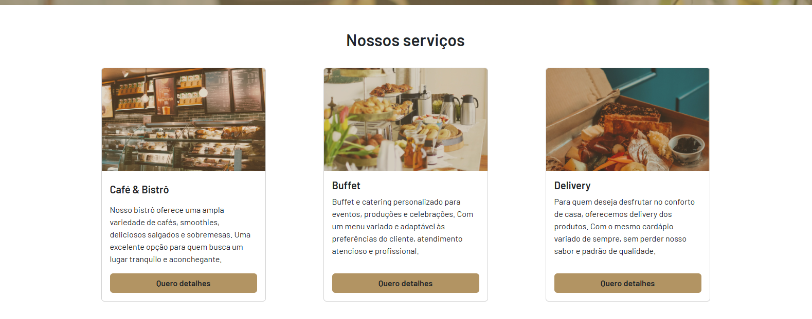

# Café & Bistrô Serenatto




## Sobre o Projeto

O **Café & Bistrô Serenatto** é um projeto fictício desenvolvido para fins educacionais. Ele apresenta uma interface moderna e responsiva para um site de cafeteria, com seções que destacam os serviços, produtos e informações de contato.

## Funcionalidades

- **Navegação Responsiva**: Menu adaptável para dispositivos móveis e desktops.
- **Seções Informativas**: Apresentação de serviços, produtos e informações sobre o café.
- **Modo Noturno**: Alternância entre temas claro e escuro.
- **Formulário de Contato**: Permite que os usuários entrem em contato diretamente pelo site.

## Tecnologias Utilizadas

- **HTML5**: Estruturação do conteúdo.
- **CSS3**: Estilização e layout responsivo.
- **Bootstrap**: Framework para design responsivo e componentes prontos.
- **JavaScript**: Funcionalidades interativas, como o modo noturno.

## Como Executar

1. Clone o repositório:
   ```bash
   git clone https://github.com/seu-usuario/seu-repositorio.git
   ```

2. Abra o arquivo `index.html` no navegador para visualizar o projeto.